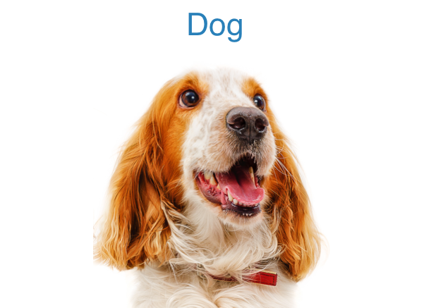
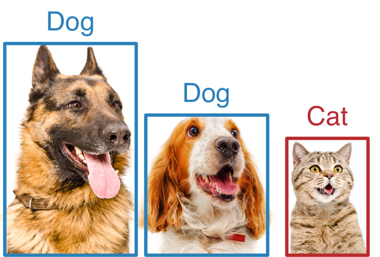
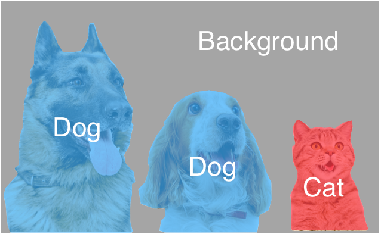
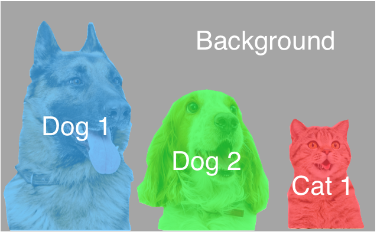
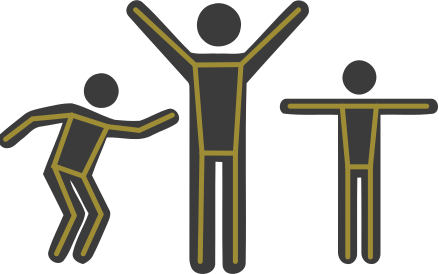

# pytorch-cv

Convert the [gluon-cv](https://github.com/dmlc/gluon-cv/) to pytorch. (And add more models from others) 

> Note: use pytorch-nightly （due to `nn.SyncBatchNorm`）

## Enviroment

```shell
# 1. create new enviroment
conda env create -f environment.yml
source activate ptcv
# 2. install opencv 
conda install -c menpo opencv3
# 3. install pytorch (https://pytorch.org/get-started/locally/)
conda install pytorch-nightly cudatoolkit=9.0 -c pytorch  # choose your cuda version
# # 4. install mxnet and gluoncv (options---for convert pre-trained gluon model)
# pip install mxnet-cu92   # (https://beta.mxnet.io/install.html, choose your cuda version)
# pip install gluoncv --pre --upgrade
```

### build cpp-extension (for object detection)

> Note: it will delete after torchvision merge this [pull-826](https://github.com/pytorch/vision/pull/826)

```shell
cd model
python setup.py build_ext develop
```

## Scheduler

|                         Application                          |              Illustration               |                       Available Models                       |
| :----------------------------------------------------------: | :-------------------------------------: | :----------------------------------------------------------: |
| **Image Classification:** <br>recognize an object in an image. |   | [CIFAR10](scripts/cifar), [IMAGENET](scripts/imagenet) |
| **Object Detection:** <br>detect multiple objects with their <br>bounding boxes in an image. |       | [SSD](scripts/ssd), [YOLO3](scripts/yolo), [Faster-RCNN](scripts/faster_rcnn), [CenterNet](scripts/centernet/README.md) |
| **Semantic Segmentation:** <br>associate each pixel of an image <br>with a categorical label. |  | [FCN, DeepLabv3, PSPNet, DANet](scripts/segmentation) |
| **Instance Segmentation:** <br>detect objects and associate <br>each pixel inside object area with an <br>instance label. |  | [Mask RCNN](scripts/mask_rcnn), [YOLACT](scripts/yolact) |
| **Pose Estimation:** <br>detect human pose <br>from images.  |        |         [Simple-Pose](scripts/simple_pose)         |

## TODO

- [ ] Provide converted models (BaiduYun and GoogleDrive)
- [ ] Compare the backbone performance with [torchvison](https://github.com/pytorch/vision) and [pretrained-models.pytorch](https://github.com/Cadene/pretrained-models.pytorch) , and replace with better one.
- [ ] Improve performance
- [ ] Add more training code and models
- [ ] Move convert code from master to branch